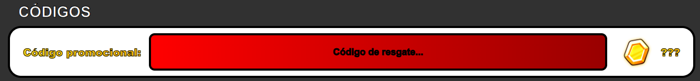
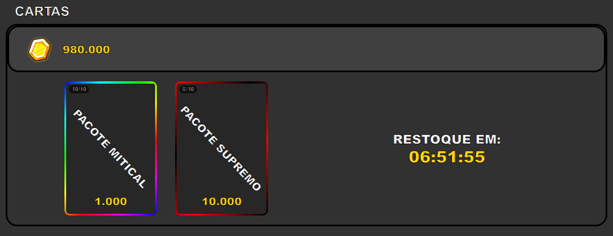
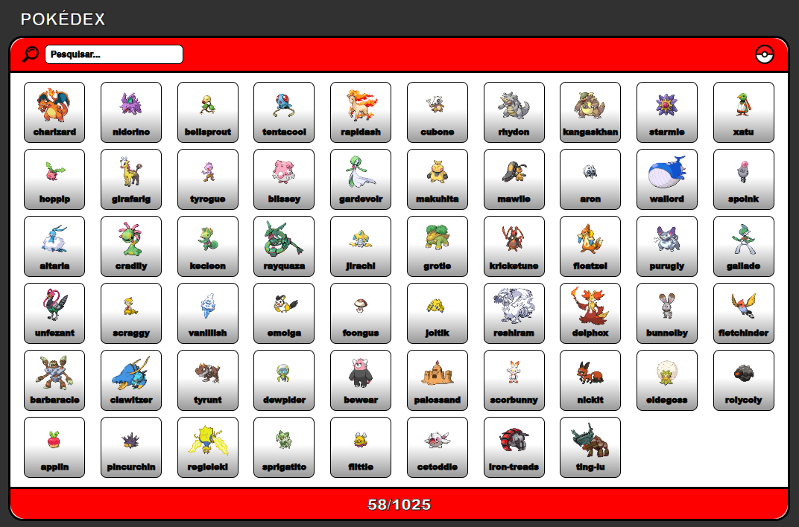

  

# Pokédex - TCG (Unofficial)
Projeto baseado na coleção de cartas de Pokémon. Conteúdo dos personagens obtidos por meio da API <ins>pokeapi</ins>.
> **Projeto solicitado para obtenção de nota parcial A2 da matéria Programação Web do curso de ADS na Universidade Cruzeiro Do Sul.**

## Informações
O projeto se trata de um <ins>minigame ou simulador de gacha</ins>, o player obtém um valor de moedas ao entrar pela primeira vez ou resgatando códigos, e logo após tem a opção de <ins>abrir pacotes de cartas</ins>, cada pacote contém um total de 5 cartas/personagens, conforme obtém pokémons, a <ins>Pokédex é preenchida conforme o que foi obtido</ins>.

## Requisitos cobrados no projeto
- Interface dinâmica e intuitiva.
- Validação de entradas do usuário.
- Persistência de dados no localStorage ou leitura/escrita de JSON/XML.
- Capacidade de adicionar, editar e remover itens.
- Filtragem ou busca de conteúdo.
- Status visual claro (itens ativos, concluídos, selecionados).

## Código para teste.

    <code>FirstCodeDev</code> - 
     
    <b>1.000.000</b>

  

## Preview

  
  

